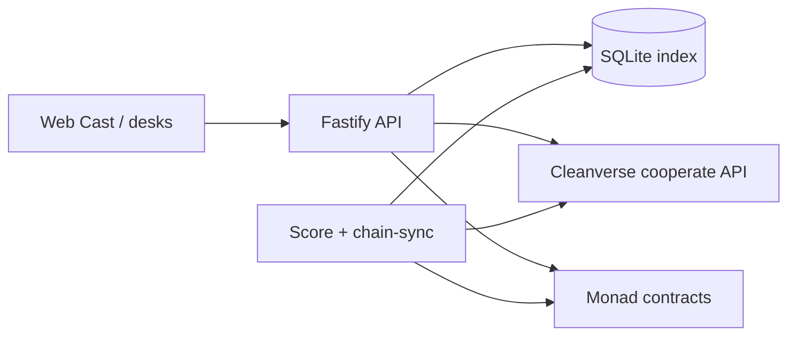

# OPERA PROTOCOL

Cleanverse Build: Verified Finance Hackathon · RWA Track · August 2026

*Compliance-Native Living Operating Rights for Real-World Assets*

Version 1.0 · August 2026

Built on Monad · Powered by the Cleanverse Compliance Stack

---

## Important links

| Resource | Link |
| --- | --- |
| **One pager (start here)** | [Google Doc](https://docs.google.com/document/d/19zYYCJJuM1MCjDgkXW6WrM95VYdKsBUHsJW7HyFfKK0/edit?usp=sharing) — problem · solution · CVI·CVA · chain · roles/flows · judging criteria |
| **Live app (Railway)** | [opera-web-production.up.railway.app](https://opera-web-production.up.railway.app) |
| **Live API** | [opera-backend-production.up.railway.app](https://opera-backend-production.up.railway.app) (`GET /health` → `{"ok":true}`) |
| **Pitch deck** | [opera-pitch.pages.dev](https://opera-pitch.pages.dev/) |
| **Demo video** | [YouTube](https://www.youtube.com/watch?v=mgChF-R9C2Q) |
| **How to demo** | [docs/HOW_TO_DEMO.md](https://github.com/SamFelix03/opera/blob/master/docs/HOW_TO_DEMO.md) — click-by-click Cast path + behind-the-scenes (Cleanverse + Monad) |
| **Verification** | [GATE_LOG.md](https://github.com/SamFelix03/opera/blob/master/docs/GATE_LOG.md) (C0–C14 PASS) · [e2e-test-report.md](https://github.com/SamFelix03/opera/blob/master/docs/e2e-test-report.md) (25/25) · [OperaSuite.t.sol](https://github.com/SamFelix03/opera/blob/master/packages/contracts/test/OperaSuite.t.sol) |
| **Source repository** | [github.com/SamFelix03/opera](https://github.com/SamFelix03/opera) |
| **Production scale plan** | [docs/PRODUCTION_SCALE.md](https://github.com/SamFelix03/opera/blob/master/docs/PRODUCTION_SCALE.md) — Postgres, real KYC→A-Pass, workers, indexer, custody, Fiat Ramp |
| **Sample audit export** | [d76fd19d…json](https://github.com/SamFelix03/opera/blob/master/data/demo-exports/d76fd19d-3718-488e-b0a3-f2b0aa64b545.json) — live Monad + Cleanverse A-Token run (`settlement.mode: "opera-atoken"`), 48 events, EIP-191 signed |
| **Deployments config** | [monad-testnet.json](https://github.com/SamFelix03/opera/blob/master/config/deployments/monad-testnet.json) |
| **A-Token launch record** | [opera-atoken.json](https://github.com/SamFelix03/opera/blob/master/config/deployments/opera-atoken.json) |


### Deployed contracts (Monad Testnet · chainId `10143`)

| Contract | Address |
| --- | --- |
| Settlement (Cleanverse A-Token · `OPRACVA3275`) | [0x6A7942B254f84822f7237c6C14aD78A00a22BC4E](https://testnet.monadvision.com/address/0x6A7942B254f84822f7237c6C14aD78A00a22BC4E) |
| OperaToken (legacy local ERC20) | [0x39Ae00FA57B509De9f4Da14B290e80924541AfD2](https://testnet.monadvision.com/address/0x39Ae00FA57B509De9f4Da14B290e80924541AfD2) |
| AssetRegistry | [0x83B831848eE0A9a2574Cf62a13c23d8eDCa84E9F](https://testnet.monadvision.com/address/0x83B831848eE0A9a2574Cf62a13c23d8eDCa84E9F) |
| ScoreStore | [0x3DCE9d2269fCB6b2F98619FC417dD0668Ae636C4](https://testnet.monadvision.com/address/0x3DCE9d2269fCB6b2F98619FC417dD0668Ae636C4) |
| LORRegistry | [0xc5E78532225B18e174FeCe089A854ac628179476](https://testnet.monadvision.com/address/0xc5E78532225B18e174FeCe089A854ac628179476) |
| MandateRegistry | [0xe33c7296173953C8376D14C7AA2D64Bb946a4644](https://testnet.monadvision.com/address/0xe33c7296173953C8376D14C7AA2D64Bb946a4644) |
| RevenueManager | [0x583c17fDf9031ece81251eA2f8c819C84fE7f69d](https://testnet.monadvision.com/address/0x583c17fDf9031ece81251eA2f8c819C84fE7f69d) |
| RightsPriceOracle | [0x03002008F0DD0Bcc06CF40A5973bCebc220B1B66](https://testnet.monadvision.com/address/0x03002008F0DD0Bcc06CF40A5973bCebc220B1B66) |
| Cleanverse AccessCore (platform) | [0x8F118338a1fa41E7Fa86Be19A4e8B99Ed58A6EcC](https://testnet.monadvision.com/address/0x8F118338a1fa41E7Fa86Be19A4e8B99Ed58A6EcC) |
| Cleanverse A-Pass NFT (platform) | [0xbA82D189540CaC9DC6FF46B6837CaC1BFdEC58B9](https://testnet.monadvision.com/address/0xbA82D189540CaC9DC6FF46B6837CaC1BFdEC58B9) |
| Deployer / treasury | [0x2514844F312c02Ae3C9d4fEb40db4eC8830b6844](https://testnet.monadvision.com/address/0x2514844F312c02Ae3C9d4fEb40db4eC8830b6844) |
| Score writer | [0x99Cf8b5a338B86f1360eaf6a1c913634E36201E8](https://testnet.monadvision.com/address/0x99Cf8b5a338B86f1360eaf6a1c913634E36201E8) |
| Cleanverse Validator pool (ScoreStore) | [0x3DCE9d2269fCB6b2F98619FC417dD0668Ae636C4](https://testnet.monadvision.com/address/0x3DCE9d2269fCB6b2F98619FC417dD0668Ae636C4) |

Sample on-chain txs from the export above (Monad testnet):

| Step | Tx |
| --- | --- |
| Energy score = 100 | [0xcc7b25988a8f0aa3…](https://testnet.monadvision.com/tx/0xcc7b25988a8f0aa38ce64b29d1b74183945bf5e20182cd72507c2bf129f48b0f) |
| Maint score = 88 | [0xd2708c362931eb41…](https://testnet.monadvision.com/tx/0xd2708c362931eb41ddd1a5a380a1c75a57fe82119647df587516a79bdf8d8d73) |
| Revenue distribute | [0xa91744f8b62461f7…](https://testnet.monadvision.com/tx/0xa91744f8b62461f7669e308d850b2efe948ae2b87c4ed38451c392b755fc1f38) |
| Oracle `recordPrice` | [0x83b9d6e4f1db1d26…](https://testnet.monadvision.com/tx/0x83b9d6e4f1db1d260dc6fa94875fbc3bae0f7327b08ba79fb8f688fa01fd9f5d) |
| Frozen score = 31 | [0xe10777c59421376c…](https://testnet.monadvision.com/tx/0xe10777c59421376c1158b576f3fc757d464ad01421f0c9daa492ad94a4537d19) |
| Maint LOR auto-list | [0x357ef385ad91ec4d…](https://testnet.monadvision.com/tx/0x357ef385ad91ec4d91b8570075228a73ca18e2307a12a1d5725f14be7a46c6d5) |
| Replacement acquire | [0x69a95a2147c8ddab…](https://testnet.monadvision.com/tx/0x69a95a2147c8ddabc0dd3bfb577db06a1da58f4795fea9fa6a03955aacdda1d2) |


---


## Repository layout


| Package | Role |
| --- | --- |
| [packages/cleanverse-client](https://github.com/SamFelix03/opera/tree/master/packages/cleanverse-client) | AES-256-CBC Cleanverse cooperate API client, HMAC webhooks |
| [packages/contracts](https://github.com/SamFelix03/opera/tree/master/packages/contracts) | Foundry: ScoreStore, LORRegistry, MandateRegistry, RevenueManager, RightsPriceOracle, AssetRegistry, OperaToken |
| [packages/backend](https://github.com/SamFelix03/opera/tree/master/packages/backend) | Fastify API, SIWE, score worker, cast demo, SQLite index, A-Token webhook |
| [packages/agents](https://github.com/SamFelix03/opera/tree/master/packages/agents) | Local `OperaAgent` processes (on-chain bid / revenue / inspection) |
| [packages/web](https://github.com/SamFelix03/opera/tree/master/packages/web) | Owner / Operator / Market / Playground / Audit / Demo cast UI |


### Quick start

```bash
cp config/.env.example config/.env   # CLEANVERSE_*, DEPLOYER_*, MONAD_*, CLEANVERSE_VALIDATOR_POOL
pnpm install
pnpm --filter @opera/backend dev     # :8787
pnpm --filter @opera/web dev         # :5173 → proxies /api
```

Contracts are already deployed — see addresses above. Demo cast: open Cast HQ → **Seed cast** → follow Owner / Operator / Market / Playground desks.

### Build & verification

```bash
pnpm typecheck
pnpm test                                          # vitest (AES, SIWE, webhook HMAC, …)
pnpm --filter @opera/contracts test                # forge test — OperaSuite.t.sol
```



Evidence: [gate log](https://github.com/SamFelix03/opera/blob/master/docs/GATE_LOG.md) · [e2e report](https://github.com/SamFelix03/opera/blob/master/docs/e2e-test-report.md) · [signed audit sample](https://github.com/SamFelix03/opera/blob/master/data/demo-exports/d76fd19d-3718-488e-b0a3-f2b0aa64b545.json) · live Railway + MonadVision links above.

---


## 1. Executive Summary

Opera Protocol is a compliance-native RWA lifecycle platform on Monad. It models who is authorized to operate a tokenized asset — collect revenue, service it, distribute proceeds — and continuously reprices that authority from Cleanverse identity and transfer compliance.

The central instrument is the **Living Operating Right (LOR)**: an on-chain right whose yield, transfer cost, and market status move with the holder's compliance score. Settlement uses Cleanverse A-Token (`OPRACVA3275` / oCVA). Identity uses Cleanverse A-Pass. Economic actions are gated with `verify_apass` and Cleanverse Validator `verify` against the ScoreStore compliance pool.

Three primitives ship in this build:

- **Living Operating Rights** — mint, transfer, acquire, auto-list on score drop; yield bonded by score bands
- **Agent Mandate Market** — publish / bid / award mandates with oCVA stake; local `OperaAgent` can bid and operate
- **Rights Price Oracle** — `recordPrice` + TWAP for asset categories

> **TRACK FIT:** CVA settlement, CVI/A-Pass identity, CCP validator eligibility, Travel Rule downloads after key txs, and score-gated LOR lifecycle on Monad testnet.

---


## 2. Problem Statement


### 2.1 The Issuance-Only Gap

Most RWA platforms stop at ownership tokens. Real assets keep operating after issuance — managers, operators, distributors — and those relationships are usually off-chain with no automatic response when compliance degrades.

### 2.2 The Static Delegation Problem

Binary whitelist/revoke models leave a window where a degraded operator still holds full authority. Opera prices authority continuously so degradation has immediate economic effect (yield hold, higher transfer cost, auto-list).

### 2.3 Operational automation

Operators can run local `OperaAgent` processes that bid and execute within mandate constraints (`minScore`, stake, `maxSpendPerTx`). Mandates and stakes are on-chain; agents are Opera processes, not a separate Cleanverse agent product.

---


## 3. Solution Overview

Every operational action in the demo — hire (mint/bid), distribute, freeze, acquire — runs through LORs, ScoreStore, and Cleanverse A-Pass / A-Token rails.

### 3.1 Why This is Different


| Dimension          | Typical RWA platforms      | Opera Protocol                                     |
| ------------------ | -------------------------- | -------------------------------------------------- |
| Ownership question | Who owns this asset?       | Who is currently authorized to operate it?         |
| Compliance timing  | Checked mainly at transfer | Reprices authority on score updates                |
| Delegation         | Static until manual revoke | Yield / fee / listing respond to score             |
| Agents             | Optional off-chain bots    | Staked mandate participants (`OperaAgent` + desks) |
| Compliance role    | Gate                       | Pricing engine for LOR economics                   |


---


## 4. Core Primitives


### 4.1 Living Operating Rights (LORs)

An LOR grants authority for a scoped operation on a registered asset (e.g. energy-revenue, maintenance). It is minted on `LORRegistry` with `holder`, `scope`, and `minScoreToHold`.

#### The Compliance Score

Scores are written to `ScoreStore` by an authorised writer. Weights live in [score.ts](https://github.com/SamFelix03/opera/blob/master/packages/backend/src/score.ts):


| Signal                   | Source in this build                                                                                         | Weight |
| ------------------------ | ------------------------------------------------------------------------------------------------------------ | ------ |
| CVI tenure               | A-Pass `registeredAt` / `expirationTime` → tenure days                                                       | 40%    |
| CCP eligibility          | `validator/verify` against ScoreStore pool (`CLEANVERSE_VALIDATOR_POOL`); `query_txs` as supporting signal   | 40%    |
| Travel Rule completeness | `query_txs` transfer history + `download_travel_rule` after distribute/acquire for audit artefacts           | 20%    |


Frozen A-Pass (`status=2`) multiplies raw score by **0.35** (demo 88 → 31). Score worker ticks on `SCORE_INTERVAL_MS` (~15s) when `WORKERS_ENABLED=1`.

#### The Three Economic Mechanisms

**Yield Bonding** — `RevenueManager.distribute` splits gross oCVA: 50% to asset owner; operator share by score band:


| Score band | Operator yield | Escrow / slash        |
| ---------- | -------------- | --------------------- |
| 95–100     | 100% paid      | None                  |
| 80–94      | 85% / 15%      | Partial escrow        |
| 70–79      | 60% / 40%      | Significant escrow    |
| Below 70   | 0%             | Full to slashing pool |


**Transfer Cost Pricing** — `LORRegistry` transfer fee bps = `max(50, 5000 − score×45)`.

**Auto-Listing** — when score < threshold (default **72**), `maybeAutoList` / `setAutoListed` lists the LOR for acquisition on the Transfer Market.

### 4.2 Agent Mandate Market

- Owner publishes a mandate on `MandateRegistry`: `minScore`, `jurisdictionRoot`, `stakeAmount`, `maxSpendPerTx`
- Operators (desk or `OperaAgent`) approve oCVA and `bid`
- Before bid, backend enforces `verify_apass`, validator eligibility, and A-Pass `countries` vs `jurisdictionRoot` (demo: SG)
- Owner awards a winner; stake settles in oCVA


### 4.3 Rights Price Oracle

`RightsPriceOracle.recordPrice(category, price)` and `twap(category, window)`. Demo / cast records category prices after market moves; used as a compliance-quality index signal for the asset class.

---


## 5. Cleanverse Stack Integration

Opera wires Cleanverse cooperate APIs for identity, settlement, CCP eligibility, Travel Rule artefacts, and institutional lookups.

| Layer | Code |
| --- | --- |
| Client (AES, HMAC, cooperate methods) | [cleanverse-client/src/index.ts](https://github.com/SamFelix03/opera/blob/master/packages/cleanverse-client/src/index.ts) |
| Backend helpers | [cleanverse-helpers.ts](https://github.com/SamFelix03/opera/blob/master/packages/backend/src/lib/cleanverse-helpers.ts) |
| Product `/v1/*` routes | [product-routes.ts](https://github.com/SamFelix03/opera/blob/master/packages/backend/src/product-routes.ts) |
| Cast actions | [cast-actions.ts](https://github.com/SamFelix03/opera/blob/master/packages/backend/src/demo/cast-actions.ts) |
| Demo orchestrator | [orchestrator.ts](https://github.com/SamFelix03/opera/blob/master/packages/backend/src/demo/orchestrator.ts) |
| Score worker | [score-worker.ts](https://github.com/SamFelix03/opera/blob/master/packages/backend/src/score-worker.ts) |
| Score weights | [score.ts](https://github.com/SamFelix03/opera/blob/master/packages/backend/src/score.ts) |
| A-Token webhook | [backend index.ts](https://github.com/SamFelix03/opera/blob/master/packages/backend/src/index.ts) |
| Web API wrappers | [web/src/api.ts](https://github.com/SamFelix03/opera/blob/master/packages/web/src/api.ts) |
| Chain error mapping | [chain-errors.ts](https://github.com/SamFelix03/opera/blob/master/packages/backend/src/lib/chain-errors.ts) |

Env: `CLEANVERSE_BASE_URL`, `CLEANVERSE_API_ID`, `CLEANVERSE_API_KEY`, `CLEANVERSE_VALIDATOR_POOL` (ScoreStore).

### 5.0 Integration map

| # | Capability | Role in Opera | Code |
| --- | --- | --- | --- |
| 1 | AES-256-CBC | Encrypted write bodies | [client](https://github.com/SamFelix03/opera/blob/master/packages/cleanverse-client/src/index.ts) · [crypto.test.ts](https://github.com/SamFelix03/opera/blob/master/packages/cleanverse-client/src/crypto.test.ts) |
| 2 | Webhook HMAC | `POST /webhooks/atoken-apply` | [index.ts](https://github.com/SamFelix03/opera/blob/master/packages/backend/src/index.ts) · [webhook.test.ts](https://github.com/SamFelix03/opera/blob/master/packages/backend/src/webhook.test.ts) |
| 3 | `generate_apass` | Identity bootstrap (`identityDataList`, SG) | [ensureApass](https://github.com/SamFelix03/opera/blob/master/packages/backend/src/lib/cleanverse-helpers.ts#L128) · [orchestrator](https://github.com/SamFelix03/opera/blob/master/packages/backend/src/demo/orchestrator.ts) |
| 4 | `query_apass` (+ list tenure) | Status, countries, tenure | [queryApassStatus](https://github.com/SamFelix03/opera/blob/master/packages/backend/src/lib/cleanverse-helpers.ts#L68) |
| 5 | `update_status` | Freeze (`2`) / activate (`1`) | [freezeWallet](https://github.com/SamFelix03/opera/blob/master/packages/backend/src/lib/cleanverse-helpers.ts#L184) · [activateWallet](https://github.com/SamFelix03/opera/blob/master/packages/backend/src/lib/cleanverse-helpers.ts#L197) · [cast](https://github.com/SamFelix03/opera/blob/master/packages/backend/src/demo/cast-actions.ts) · [product-routes](https://github.com/SamFelix03/opera/blob/master/packages/backend/src/product-routes.ts) · [ensure-apass-active.ts](https://github.com/SamFelix03/opera/blob/master/scripts/ensure-apass-active.ts) |
| 6 | `verify_apass` (code 4) | Hard gate mint / bid / acquire / distribute | [requireValidApass](https://github.com/SamFelix03/opera/blob/master/packages/backend/src/lib/cleanverse-helpers.ts#L209) · [requireComplianceForAction](https://github.com/SamFelix03/opera/blob/master/packages/backend/src/lib/cleanverse-helpers.ts#L322) |
| 7 | `query_apass_list` | Institution roster + tenure backfill | [listInstitutionApasses](https://github.com/SamFelix03/opera/blob/master/packages/backend/src/lib/cleanverse-helpers.ts#L372) · [GET /v1/apass/list](https://github.com/SamFelix03/opera/blob/master/packages/backend/src/product-routes.ts#L172) |
| 8 | Country tags / geo | Mandate `jurisdictionRoot` vs A-Pass `countries` | [requireJurisdiction](https://github.com/SamFelix03/opera/blob/master/packages/backend/src/lib/cleanverse-helpers.ts#L249) · [cast bid](https://github.com/SamFelix03/opera/blob/master/packages/backend/src/demo/cast-actions.ts) |
| 9 | A-Token launch + apply status + webhook | Settlement `OPRACVA3275` | [launch-opera-atoken.ts](https://github.com/SamFelix03/opera/blob/master/scripts/launch-opera-atoken.ts) · [opera-atoken.json](https://github.com/SamFelix03/opera/blob/master/config/deployments/opera-atoken.json) |
| 10 | A-Token settlement (oCVA) | Stakes, acquire, revenue | [monad-testnet.json](https://github.com/SamFelix03/opera/blob/master/config/deployments/monad-testnet.json) |
| 11 | A-Token A-Pass transfer policy | Frozen seller → `APassNotActive`; temp-activate on acquire | [chain-errors.ts](https://github.com/SamFelix03/opera/blob/master/packages/backend/src/lib/chain-errors.ts) · [cast acquire](https://github.com/SamFelix03/opera/blob/master/packages/backend/src/demo/cast-actions.ts) |
| 12 | `atoken/add_rule` + `rules` | SG country whitelist on oCVA | [ensureAtokenSgCountryRule](https://github.com/SamFelix03/opera/blob/master/packages/backend/src/lib/cleanverse-helpers.ts#L404) · [POST ensure-sg](https://github.com/SamFelix03/opera/blob/master/packages/backend/src/product-routes.ts#L213) · [ensure-atoken-sg-rule.ts](https://github.com/SamFelix03/opera/blob/master/scripts/ensure-atoken-sg-rule.ts) |
| 13 | Validator grant / register / `verify` / rules | CCP pool = ScoreStore | [register-validator-pool.ts](https://github.com/SamFelix03/opera/blob/master/scripts/register-validator-pool.ts) · [checkValidatorEligibility](https://github.com/SamFelix03/opera/blob/master/packages/backend/src/lib/cleanverse-helpers.ts#L282) |
| 14 | `query_txs` | Transfer history for score signals | [score-worker.ts](https://github.com/SamFelix03/opera/blob/master/packages/backend/src/score-worker.ts) |
| 15 | `download_travel_rule` | After distribute/acquire; audit pack | [downloadTravelRuleForTx](https://github.com/SamFelix03/opera/blob/master/packages/backend/src/lib/cleanverse-helpers.ts#L344) · [POST /v1/travel-rule](https://github.com/SamFelix03/opera/blob/master/packages/backend/src/product-routes.ts#L225) · [orchestrator](https://github.com/SamFelix03/opera/blob/master/packages/backend/src/demo/orchestrator.ts) · [cast](https://github.com/SamFelix03/opera/blob/master/packages/backend/src/demo/cast-actions.ts) |
| 16 | `query_deposit_address` | Deposit wallet lookup | [queryDepositAddress](https://github.com/SamFelix03/opera/blob/master/packages/backend/src/lib/cleanverse-helpers.ts#L385) · [GET deposit-address](https://github.com/SamFelix03/opera/blob/master/packages/backend/src/product-routes.ts#L184) |
| 17 | `query_institution_white_list` | Institution whitelist read | [queryInstitutionWhitelist](https://github.com/SamFelix03/opera/blob/master/packages/backend/src/lib/cleanverse-helpers.ts#L389) · [GET whitelist](https://github.com/SamFelix03/opera/blob/master/packages/backend/src/product-routes.ts#L198) |
| 18 | EIP-191 `signOwnerMessage` | Validator grant/register over Ownable `owner()` | [signOwnerMessage](https://github.com/SamFelix03/opera/blob/master/packages/cleanverse-client/src/index.ts#L66) · [register-validator-pool.ts](https://github.com/SamFelix03/opera/blob/master/scripts/register-validator-pool.ts) · [ownerSignatureFor](https://github.com/SamFelix03/opera/blob/master/packages/backend/src/lib/cleanverse-helpers.ts#L442) |

Unified gate: [requireComplianceForAction](https://github.com/SamFelix03/opera/blob/master/packages/backend/src/lib/cleanverse-helpers.ts#L322) = `verify_apass` + [requireJurisdiction](https://github.com/SamFelix03/opera/blob/master/packages/backend/src/lib/cleanverse-helpers.ts#L249) + [checkValidatorEligibility](https://github.com/SamFelix03/opera/blob/master/packages/backend/src/lib/cleanverse-helpers.ts#L282).

### 5.1 A-Pass (CVI identity)

1. Generate / query / activate (`status=1`) / freeze (`status=2`) — helpers in the map above
2. Country tags from `issuingCountryISO2` at generate (demo: SG)
3. Freeze drives score collapse — [score-worker](https://github.com/SamFelix03/opera/blob/master/packages/backend/src/score-worker.ts) · [score.ts](https://github.com/SamFelix03/opera/blob/master/packages/backend/src/score.ts)
4. Tenure feeds the 40% CVI score term
5. Country tags gate bids when mandate `jurisdictionRoot` is set (`keccak256("SG")`)
6. `verify_apass` hard-gates mint, bid, acquire, distribute
7. A-Pass ensured on operators **and** protocol contracts that receive oCVA — [orchestrator](https://github.com/SamFelix03/opera/blob/master/packages/backend/src/demo/orchestrator.ts)
8. Product APIs: [product-routes `/v1/apass/*`](https://github.com/SamFelix03/opera/blob/master/packages/backend/src/product-routes.ts#L132); cast [ensureApass](https://github.com/SamFelix03/opera/blob/master/packages/backend/src/demo/cast-actions.ts)

Backend enforces jurisdiction before `bid` via A-Pass `countries` vs mandate `jurisdictionRoot`.

### 5.2 A-Token (CVA settlement)

Cleanverse LAUNCH A-Token `OPRACVA3275` ([opera-atoken.json](https://github.com/SamFelix03/opera/blob/master/config/deployments/opera-atoken.json)) is settlement for stakes, acquire, and revenue. SG allow-rule via `atoken/add_rule`. Frozen A-Pass cannot receive oCVA — acquire temp-activates seller then re-freezes ([cast acquire](https://github.com/SamFelix03/opera/blob/master/packages/backend/src/demo/cast-actions.ts)).

### 5.3 CCP eligibility & Travel Rule

- Score weights **40 / 40 / 20** in [score.ts](https://github.com/SamFelix03/opera/blob/master/packages/backend/src/score.ts)
- Compliance pool = **ScoreStore**; [register-validator-pool.ts](https://github.com/SamFelix03/opera/blob/master/scripts/register-validator-pool.ts); env `CLEANVERSE_VALIDATOR_POOL`
- `validator/verify` feeds CCP term ([score-worker](https://github.com/SamFelix03/opera/blob/master/packages/backend/src/score-worker.ts)) and gates economic actions
- `download_travel_rule` after distribute/acquire; artefacts in export `cleanverse.travelRule[]`

### 5.4 Cryptography & webhooks

AES-256-CBC for encrypted writes; HMAC on raw body for `POST /webhooks/atoken-apply` — [index.ts](https://github.com/SamFelix03/opera/blob/master/packages/backend/src/index.ts) · [verifyWebhookSignature](https://github.com/SamFelix03/opera/blob/master/packages/cleanverse-client/src/index.ts#L50).

### 5.5 Product surfaces

| Surface | Behavior | Code |
| --- | --- | --- |
| Operator Ensure A-Pass | `/v1/apass/ensure` or cast | [product-routes](https://github.com/SamFelix03/opera/blob/master/packages/backend/src/product-routes.ts#L132) · [api.ts](https://github.com/SamFelix03/opera/blob/master/packages/web/src/api.ts) · [Operator.tsx](https://github.com/SamFelix03/opera/blob/master/packages/web/src/pages/Operator.tsx) |
| WalletBar | oCVA balance | web wallet UI |
| Market acquire | Frozen-seller A-Pass note | [Market.tsx](https://github.com/SamFelix03/opera/blob/master/packages/web/src/pages/Market.tsx) · [cast acquire](https://github.com/SamFelix03/opera/blob/master/packages/backend/src/demo/cast-actions.ts) |
| `GET /v1/me` | A-Pass + validator eligibility | [product-routes](https://github.com/SamFelix03/opera/blob/master/packages/backend/src/product-routes.ts#L97) |
| Product APIs | list / deposit / whitelist / TR / atoken rules | [product-routes](https://github.com/SamFelix03/opera/blob/master/packages/backend/src/product-routes.ts) · [api.ts](https://github.com/SamFelix03/opera/blob/master/packages/web/src/api.ts) |

### 5.6 Demo path (Cleanverse + chain)

```
setupIdentities     → generate/query A-Pass (SG country tags)
prepareCast/fund    → ensureApass on operators + protocol contracts; fund oCVA
hire (cast desks)   → verify_apass + jurisdiction + validator before mint/bid
normalOps           → verify_apass; distribute oCVA; downloadTravelRule → audit events
sanctionsEvent      → update_status(2) → score 88→31 → auto-list
replacementAcquire  → buyer compliance gate; seller ensure + verify; acquireLOR; TR; re-freeze
regulatorExport     → signed pack including cleanverse.travelRule[]
```

[orchestrator.ts](https://github.com/SamFelix03/opera/blob/master/packages/backend/src/demo/orchestrator.ts) · [cast-actions.ts](https://github.com/SamFelix03/opera/blob/master/packages/backend/src/demo/cast-actions.ts) · [HOW_TO_DEMO.md](https://github.com/SamFelix03/opera/blob/master/docs/HOW_TO_DEMO.md)

---

## Scalability plan

Hackathon stack today: Fastify + SQLite + in-process workers + Monad public RPC. The full production plan — Postgres, Redis, real KYC → A-Pass, queue-based score/indexer workers, KMS custody, multi-tenant RBAC, Travel Rule retries, Fiat Ramp readiness, SLOs, and phased delivery — lives in:

**[docs/PRODUCTION_SCALE.md](https://github.com/SamFelix03/opera/blob/master/docs/PRODUCTION_SCALE.md)**

Summary of direction:

| Area | Demo today | Production |
| --- | --- | --- |
| Data | SQLite file | Postgres + Redis + object storage |
| Identity | Stub `generate_apass` | KYC vendor (Sumsub/Persona) → Cleanverse A-Pass |
| Scores / sync | In-process loops | Queue workers + event-driven auto-list + reorg-safe indexer |
| Keys | EOAs / cast keys in DB | KMS / institutional custody; no hot demo keys |
| Settlement | oCVA on Monad testnet | Same rails + optional Cleanverse Fiat Ramp when live |

---


## 6. User Roles


| Role                      | Product surface                                                                                                                                                                                                                                                      |
| ------------------------- | -------------------------------------------------------------------------------------------------------------------------------------------------------------------------------------------------------------------------------------------------------------------- |
| Asset Owner               | Owner desk: mint LORs, publish mandates, award winners, view revenue / events ([Owner.tsx](https://github.com/SamFelix03/opera/blob/master/packages/web/src/pages/Owner.tsx)). Cast role `owner`.                                                                  |
| Operator / Agent Deployer | Operator desk: ensure A-Pass, bid + stake oCVA, portfolio, distribute, auto-list ([Operator.tsx](https://github.com/SamFelix03/opera/blob/master/packages/web/src/pages/Operator.tsx)). Optional local `OperaAgent`. Cast: `energyOp` / `maintOp` / `replacement`. |
| Institutional Investor    | Cast role `investor` + Market / oracle views                                                                                                                                                                                                                         |
| Regulator / Auditor       | Audit desk exports signed JSON/PDF event packs; cast role `regulator`                                                                                                                                                                                                |
| Compliance Officer        | Playground Rules (freeze / push score / activate) + score badges                                                                                                                                                                                                     |


---


## 7. Core User Flows


### 7.1 Asset tokenization and LOR creation

- Cast seed / `setupIdentities` ensures A-Passes for role wallets
- Asset id from deployment (`assetId: 2`) via `AssetRegistry`
- Owner mints LORs with `scope`, `holder`, `minScore`
- Playground configures auto-list threshold and simulates score bands


### 7.2 Mandate publication and bidding

- Owner publishes mandate: `minScore`, `stakeAmount`, `maxSpendPerTx`, optional `jurisdictionRoot`
- Operators (or `OperaAgent`) `bid` with oCVA stake
- Owner awards a winner
- Backend geo-check: A-Pass `countries` vs mandate `jurisdictionRoot` (demo SG) before bid


### 7.3 Continuous compliance and score-driven events

- Score worker (when `WORKERS_ENABLED=1`): A-Pass + validator/`query_txs` → `computeScore` → `ScoreStore.setScore` → maybe auto-list ([score-worker.ts](https://github.com/SamFelix03/opera/blob/master/packages/backend/src/score-worker.ts))
- Demo / cast: freeze A-Pass → push score 31 → `setAutoListed` / `maybeAutoList`
- Notifications in SQLite for owner alerts


### 7.4 Revenue distribution

- `RevenueManager.distribute(operator, gross)` pulls oCVA; 50% owner; operator half by `yieldSplit(score)` — [RevenueManager.sol](https://github.com/SamFelix03/opera/blob/master/packages/contracts/src/RevenueManager.sol#L38-L75)
- Travel Rule download after demo distribute / acquire txs


### 7.5 Regulator audit export

- Pack includes asset ids, settlement token, freeze formula, demo `events[]`, EIP-191 `contentHash` + deployer signature
- Download from Audit desk / API; samples under [data/demo-exports/](https://github.com/SamFelix03/opera/tree/master/data/demo-exports)

---


## 8. Demo Scenario

**Tokenized Solar Farm — Singapore Family Office**


|          |                                                                       |
| -------- | --------------------------------------------------------------------- |
| Asset    | Solar farm producing monthly energy revenue                           |
| Owner    | Singapore family office — A-Pass on Cleanverse                        |
| LORs     | Energy Revenue Collection · Maintenance Coordination                  |
| Mandates | Score minimum 80 · oCVA stake 5,000 per mandate · SG jurisdiction tag |


### Flow (live Monad + Cleanverse)

1. **Identities** — `generate_apass` / `query_apass` for cast roles (unless `DEMO_MOCK=1`)
2. **Hire** — mint LORs, publish mandates, bid with oCVA, award winners; scores written to `ScoreStore`
3. **Operate** — `distribute` oCVA; attempt Travel Rule download
4. **Sanctions** — `update_status(2)` on maint operator → score ×0.35 → **31** → auto-list (threshold 72)
5. **Replacement** — replacement operator acquires LOR (`acquireLOR`); seller A-Pass temporarily activated for settlement
6. **Audit** — signed JSON/PDF Opera event pack ([sample](https://github.com/SamFelix03/opera/blob/master/data/demo-exports/d76fd19d-3718-488e-b0a3-f2b0aa64b545.json))

**Full click-by-click guide (UI + behind the scenes):** [docs/HOW_TO_DEMO.md](https://github.com/SamFelix03/opera/blob/master/docs/HOW_TO_DEMO.md) · **Video:** [YouTube](https://www.youtube.com/watch?v=mgChF-R9C2Q)

**Cast HQ:** Seed → Hire → Operate → Freeze + push score (Playground) → Auto-list → Market acquire as Replacement → Audit export. Steps: `DEMO_STEPS` in [state.ts](https://github.com/SamFelix03/opera/blob/master/packages/backend/src/demo/state.ts#L18-L27).

API path: `POST /demo/bootstrap` then `POST /demo/:runId/step/:stepName` for `setupIdentities` → `setupAsset` → `fundAndStake` → `normalOps` → `sanctionsEvent` → `replacementAcquire` → `regulatorExport`.

---


## 9. Technical Architecture


### 9.1 Smart Contract Layer (Monad)


| Contract           | Responsibility                                                            |
| ------------------ | ------------------------------------------------------------------------- |
| AssetRegistry      | Asset metadata / ids                                                      |
| LORRegistry        | `mintLOR`, `transferLOR`, `setAutoListed` / `maybeAutoList`, `acquireLOR` |
| MandateRegistry    | Publish / bid / award; jurisdiction tag; principal checks                 |
| RevenueManager     | Yield bonding bands + owner 50% + escrow + `slashingPool`                 |
| ScoreStore         | Authorised `setScore`; also registered as Cleanverse Validator pool       |
| RightsPriceOracle  | `recordPrice` + `twap`                                                    |
| OperaToken         | Local ERC20 with optional `transferGate` — not primary settlement         |
| Cleanverse A-Token | External settlement ERC-20 with A-Pass transfer policy                    |


Transfer fee: [LORRegistry.sol](https://github.com/SamFelix03/opera/blob/master/packages/contracts/src/LORRegistry.sol#L67-L74) · Auto-list threshold default 72: [L25](https://github.com/SamFelix03/opera/blob/master/packages/contracts/src/LORRegistry.sol#L25).

### 9.2 Cleanverse APIs in use


| API | Use |
| --- | --- |
| A-Pass generate / query / update / verify / list | Identity, tenure, geo, hard gates |
| A-Token launch / apply status / rules / webhook | Settlement + SG country rule |
| Validator grant / register / verify / rules | CCP pool on ScoreStore; eligibility gates |
| `query_txs` | Transfer history for score signals |
| `download_travel_rule` | Post-tx + audit pack |
| Deposit address / institution whitelist | Product read APIs |


### 9.3 Backend services


| Service                             | Status                                                                                                                                                                                                         |
| ----------------------------------- | -------------------------------------------------------------------------------------------------------------------------------------------------------------------------------------------------------------- |
| Score computation worker            | ~15s loop when `WORKERS_ENABLED=1`                                                                                                                                                                             |
| Auto-listing cascade                | Worker + cast / product push                                                                                                                                                                                   |
| SQLite mandate/LOR/bid index + sync | [chain-index.ts](https://github.com/SamFelix03/opera/blob/master/packages/backend/src/chain-index.ts), [chain-sync.ts](https://github.com/SamFelix03/opera/blob/master/packages/backend/src/chain-sync.ts) |
| Mandate award                       | Manual owner award                                                                                                                                                                                             |
| Notifications                       | SQLite + UI feed                                                                                                                                                                                               |
| SIWE sessions                       | Product `/v1/*`                                                                                                                                                                                                |


### 9.4 Frontend


| Desk                                                  | Status                                 |
| ----------------------------------------------------- | -------------------------------------- |
| Owner / Operator / Market / Playground / Audit / Demo | Implemented                            |
| Cast mode                                             | Role wallets + `POST /demo/:runId/act` |
| Wallet mode                                           | wagmi / AppKit writes                  |


---


## 10. Hackathon build checklist


| Feature               | In this build                                                            |
| --------------------- | ------------------------------------------------------------------------ |
| Asset issuance        | Deployment-bound asset id + Cleanverse A-Token settlement                |
| LOR creation          | On-chain mint with scope + `minScore`                                    |
| Mandate publication   | On-chain publish with stake / minScore / maxSpend / jurisdiction tag     |
| Operator bidding      | Desk or local `OperaAgent` posts oCVA stake                              |
| Compliance score feed | ScoreStore + badges + worker/push; tenure + validator/`query_txs` inputs |
| Yield bonding         | `RevenueManager.yieldSplit` on distribute                                |
| Score degradation     | Freeze A-Pass → score 31 → LOR auto-list                                 |
| LOR transfer          | `acquireLOR` on Market / cast                                            |
| Revenue distribution  | oCVA `distribute` with score split; Travel Rule download                 |
| Audit export          | Signed Opera event pack JSON/PDF                                         |
| CCP eligibility       | `validator/verify` against ScoreStore pool (`CLEANVERSE_VALIDATOR_POOL`) |


---


## 11. Roadmap

Operational hardening and scale-out detail: **[Production Scalability & Hardening Plan](https://github.com/SamFelix03/opera/blob/master/docs/PRODUCTION_SCALE.md)** (KYC→A-Pass, Postgres, workers, indexer, custody, multi-tenant RBAC, Fiat Ramp).

### Score & compliance

- Multi-dimensional score weights by asset class
- Peer benchmarking against operator cohort
- Portable score-history credentials
- Richer CCP / AML outcome feeds when available from Cleanverse
- Production KYC vendor integration feeding `generate_apass` (see scale plan §4)

### Market

- Structured LOR products (tranches by blended score)
- External DeFi consumption of Rights Price Oracle
- Cross-chain LOR portability
- Event-driven auto-list and reorg-safe chain indexer (scale plan §§5–6)

### Institutional

- DAO governance for LOR policy on community assets
- Insurance pricing from LOR score feeds
- Sovereign / fund-of-fund mandate structures
- Multi-tenant orgs + RBAC (scale plan §10)
- Fiat settlement via Cleanverse Gateway / Fiat Ramp for live products with real funds (scale plan §9)

---


## 12. Hackathon Track Alignment


| Track requirement                 | Opera mechanism                                                                                                     |
| --------------------------------- | ------------------------------------------------------------------------------------------------------------------- |
| Compliance embedded from issuance | LOR / mandate `minScore`, A-Pass required to move oCVA, Playground + cast freeze → auto-list                        |
| CVI integrated into core logic    | A-Pass status, tenure, freeze → score → yield / listing; `verify_apass` on economic actions                         |
| CVA integrated into core logic    | Stakes, acquire, revenue use Cleanverse A-Token oCVA                                                                |
| Accredited-investor whitelisting  | Score / `minScore` gates; A-Token SG country rule; institution whitelist read API                                   |
| Transfer restrictions             | On-chain score gates + A-Token A-Pass policy; `validator/verify` on mint / bid / acquire / distribute |
| Travel Rule-compliant settlement  | `download_travel_rule` after distribute / acquire; artefacts in audit pack                                          |


---


## Security notes

- Secrets only in `config/.env` and `keys/*` (gitignored).
- Score writer and deployer are separate EOAs where configured.
- Webhook HMAC verified on **raw body** before parse; idempotent on `(txType, requestId)`.
- Cast demo private keys live in SQLite for the cast UX — treat as disposable test keys.
- Validator pool must be an Ownable contract; register with deployer owner signature, then set `CLEANVERSE_VALIDATOR_POOL` locally and on Railway backend.

---

*Opera Protocol · Cleanverse Build: Verified Finance Hackathon · RWA Track · Version 1.0 · August 2026*

*Built on Monad · Powered by Cleanverse A-Pass · A-Token · Validator · Travel Rule · Gateway*